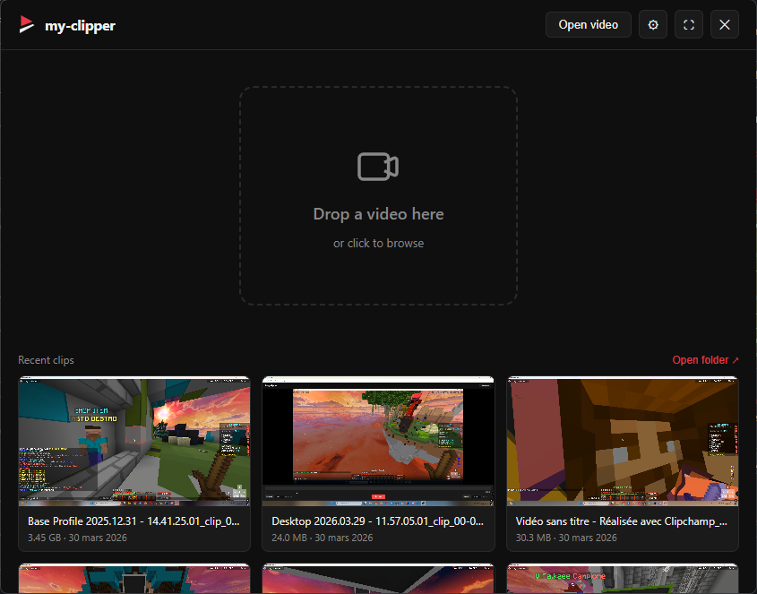
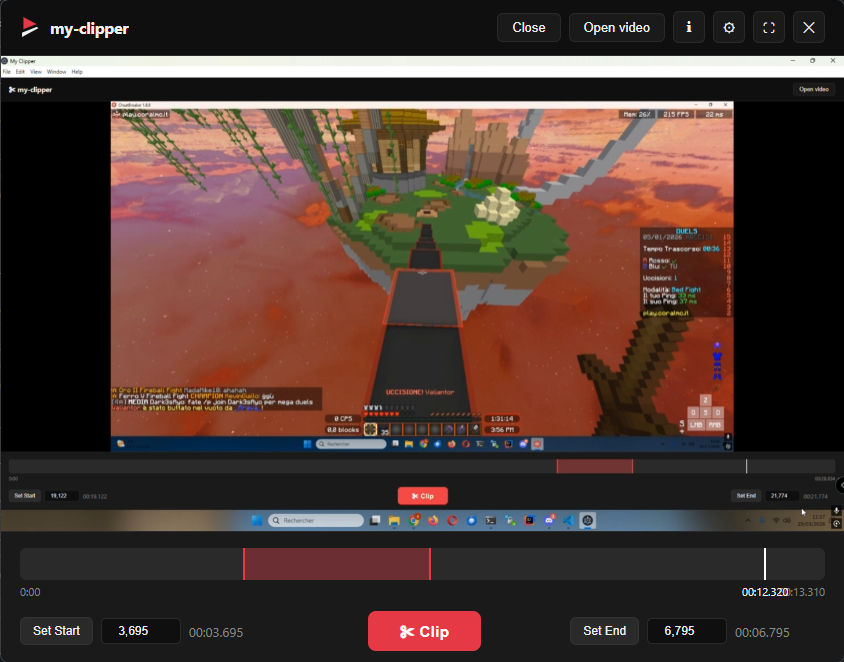

# my-clipper

[Français](#fr--français) | [English](#en--english)

<table>
  <tr>
    <td align="center"> Accueil · Home</td>
    <td align="center"> Clipper</td>
  </tr>
</table>

---

## FR — Français

**my-clipper** est un outil de découpe vidéo rapide, simple et sans perte de qualité.

- Glisse une vidéo, pose tes points d'entrée et de sortie, exporte
- **Sans réencodage** — la qualité originale est préservée, le résultat est instantané
- Interface moderne, légère, sans superflu
- **Mises à jour automatiques** — l'app se met à jour en arrière-plan

### Téléchargement

→ [Dernière version](../../releases/latest)

---

## EN — English

**my-clipper** is a fast, simple, lossless video clipper.

- Drop a video, set your in and out points, export
- **No re-encoding** — original quality preserved, instant output
- Clean, modern, no-nonsense interface
- **Auto-updates** — the app updates itself in the background

### Download

→ [Latest release](../../releases/latest)
